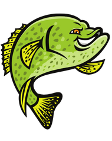
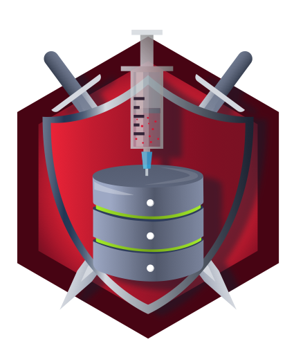

## cybersecurity-portfolio
This repository is my personal proof-of-work portfolio for cybersecurity learning.

It documents my study notes, lab work, screenshots and progress on platforms such as PortSwigger Web Security Academy and TryHackMe. The main purpose of this repository is to provide visible evidence of my practical learning process.

## PortSwigger Progress

## TryHackMe Progress
My TryHackMe progress mainly focuses on security operation fundementals.

## Badges
<table>
  <tr>
    <td align="center">
      
       
      <strong>Logging Legend</strong>
    </td>
    <td align="center">
      
       
      <strong>Phishing Expert</strong>
    </td>
    <td align="center">
      
       
      <strong>Web Attack Investigator</strong>
    </td>
    <td align="center">
      
       
      <strong>SOC Member</strong>
    </td>
    <td align="center">
      
       
      <strong>SQL Injection</strong>
    </td>
    <td align="center">
      
       
      <strong>Competent in Linux</strong>
    </td>
  </tr>
</table>

## ⚠️ Disclaimer

All content in this repository is for educational and portfolio purposes only.

All labs, screenshots, notes, and examples are based on legal training platforms, authorised lab environments and personal learning exercises.

This repository does not contain, support or encourage unauthorised testing, exploitation or malicious activity.
